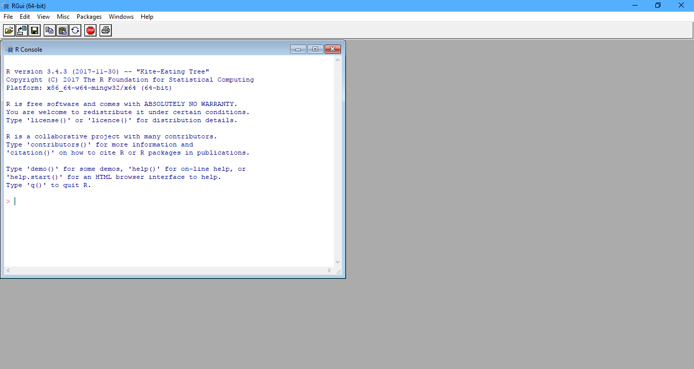
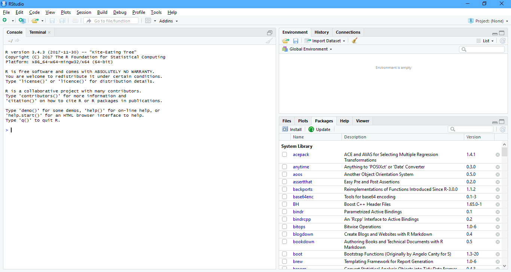

# Wprowadzenie do R

GNU R to interpretowany język programowania oraz środowisko do obliczeń statystycznych i wizualizacji wyników [Wikipedia 2017].

Robert A. Muenchen - [The Popularity of Data Science Software](http://r4stats.com/articles/popularity/)

## R

Bazowa wersja R jest do pobrania ze strony [r-project.org](https://cloud.r-project.org/). 

## RStudio

RStudio to zintegrowane środowisko programistyczne (IDE) dla języka R dostępne za darmo na stronie [RStudio](https://www.rstudio.com/products/rstudio/download/).

Z R można także korzystać w [Microsoft Visual Studio](https://www.visualstudio.com/pl/vs/rtvs/).

**W codziennej pracy RStudio jest wygodniejsze, jednak długotrwałe obliczenia lepiej uruchamiać w zwykłym R.**

## Pakiety

Podstawowe możliwości R są dosyć ograniczone. Rozszerzają je pakiety, których obecnie jest ponad 12 tysięcy. Można je przeglądać według kategorii w [CRAN Task Views](https://cran.r-project.org/web/views/) lub w wygodnej wyszukiwarce [METACRAN](https://www.r-pkg.org/).

