# Język R

Interpretowany język programowania oraz środowisko do obliczeń statystycznych i wizualizacji wyników [[Wikipedia 2022]](https://pl.wikipedia.org/wiki/R_(j%C4%99zyk_programowania%29).

- darmowy
- wieloplatformowy
- wsparcie społeczności
- wykorzystywany przez naukowców
- jedno oficjalne źródło pakietów, które ze sobą współpracują
- 23065 pakietów (27.11.2025)

--

> "R is not a language driven by the purity of its philosophy; R is a language designed to get shit done."

Hadley Wickham

---

# Możliwości R

- obliczenia i wizualizacje

- raporty, strony internetowe, podręczniki, prezentacje w [markdown](https://rmarkdown.rstudio.com/gallery.html) lub [quarto](https://quarto.org/docs/gallery/)

- [interaktywne dashboardy](https://shiny.rstudio.com/gallery/)

- [mapy](https://r.geocompx.org/)

- [zaliczenia i egzaminy](http://www.r-exams.org/)

- ...

---

# Źródła wiedzy i pomocy

- [Big Book of R](https://www.bigbookofr.com/)

- [R for Data Science](https://r4ds.hadley.nz/) - kompendium R po angielsku 

- [Ściągawki](https://posit.co/resources/cheatsheets/) - atrakcyjny wizualnie krótki opis funkcji w formacie A4

- [rweekly.org](https://rweekly.org/) - przegląd wieści ze świata R w każdy poniedziałek

- [konferencja useR! 2026](https://user2026.r-project.org/)

---

# Interfejs R

Desktop:

- R [(r-project.org)](https://www.r-project.org/) -> CRAN -> 0-Cloud -> Download R for Windows -> base

- RStudio Desktop [(https://posit.co/)](https://posit.co/download/rstudio-desktop/)

- Positron [(https://positron.posit.co/)](https://positron.posit.co/)

Online:

- Posit Cloud [posit.cloud](https://posit.cloud/)

---

class: center, middle, inverse

# Interfejs R

---

# R

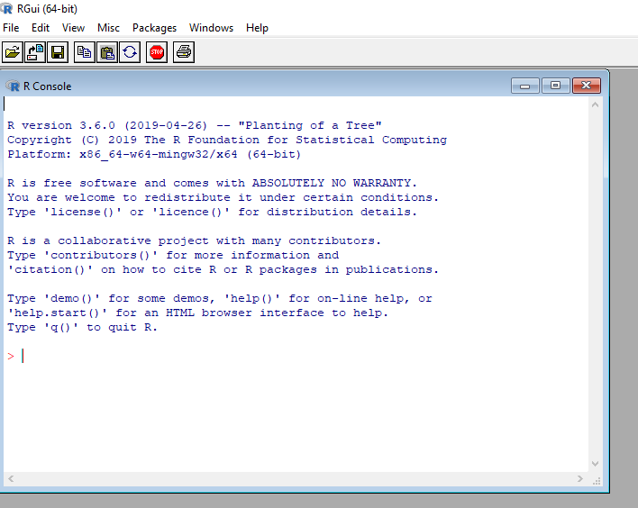

---

# RStudio

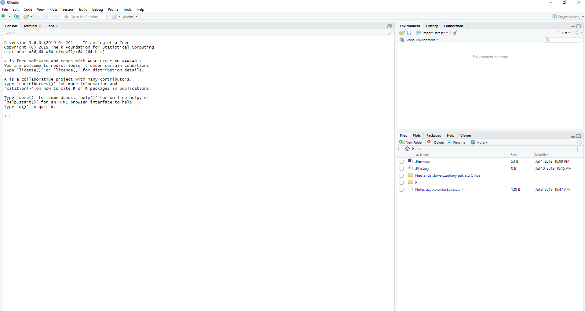

---

# R vs RStudio

.pull-left[
Zalety R

- mniej zasobożerny

- szybsze przetwarzanie 

- świetny do trybu wsadowego

]

.pull-right[
Zalety RStudio

- zarządzanie projektami

- podgląd obiektów w pamięci

- kolorowanie i podpowiadanie składni

- praca na wielu plików w różnych formatach

- tryb debugowania

- integracja z git

]

---

# Projekt

.pull-left[

- katalog roboczy (working directory)

- domyślnie _user/documents_

- funkcja `getwd()`

- w ramach katalogu roboczego nie trzeba wskazywać pełnej ścieżki do pliku

- projekt w R jest katalogiem, który zawiera plik .Rproj

- tworzenie poprzez _File -> New Project_, menu w prawym górnym rogu lub ikonę poniżej menu _Edit_

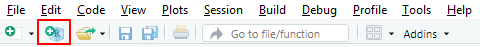

]

.pull-right[

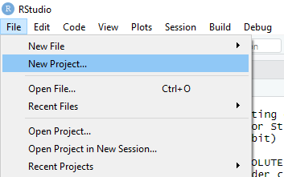

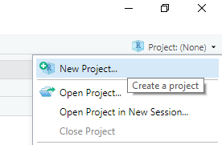

]

---

# Projekt

.pull-left[

- _New Directory_ - tworzy nowy katalog we wskazanym miejscu i powiązuje go z RStudio

- _Existing Directory_ - powiązuje istniejący już na dysku katalog z RStudio

- _Version Control_ - tworzy nowy katalog we wskazanym miejscu na podstawie repozytorium

]

.pull-right[

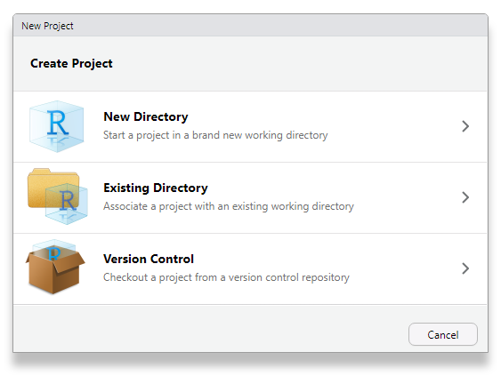

]

---

# Projekt - _New Directory_

.pull-left[

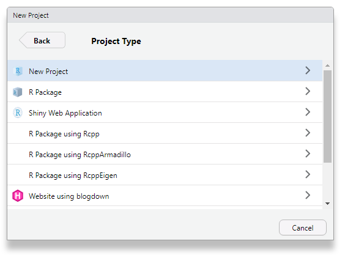

]

.pull-right[

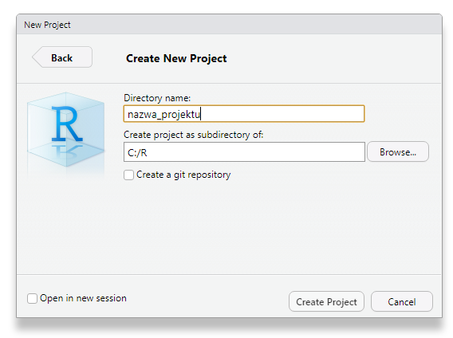

- na tym etapie możemy utworzyć repozytorium git
- _Open in new session_ powoduje utworzenie projektu w nowej instancji programu

]

--- 

# Projekt - _Existing Directory_

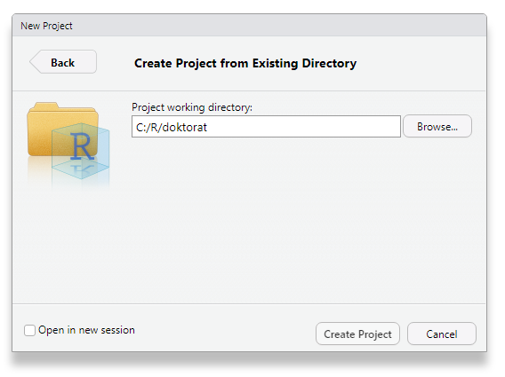

---

## Interfejs - pasek narzędzi / nowy plik

.pull-left[

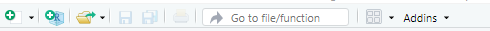

- nowy plik

- nowy projekt

- otwórz plik

- zapisz plik 

- zapisz wszystko

- drukuj

- idź do...

- widok 

- dodatki

]

.pull-right[

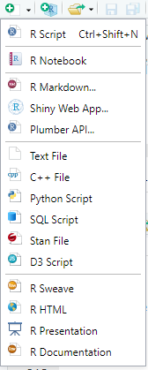

]

---

# Interfejs

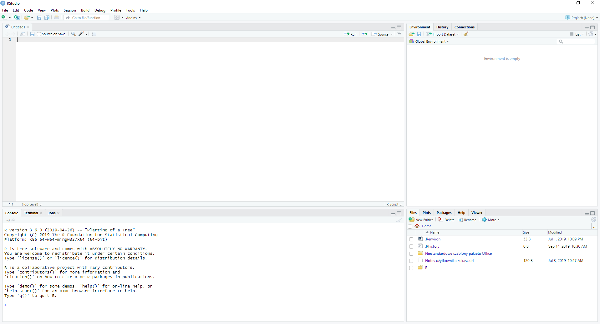

---

# Intefejs - Console

.pull-left[

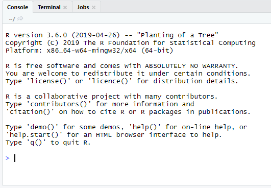

]

.pull-right[

- można wpisywać funkcje do wykonania

- tutaj pojawiają się wszystkie wyniki tekstowe

]

---

# Intefejs - Terminal

.pull-left[

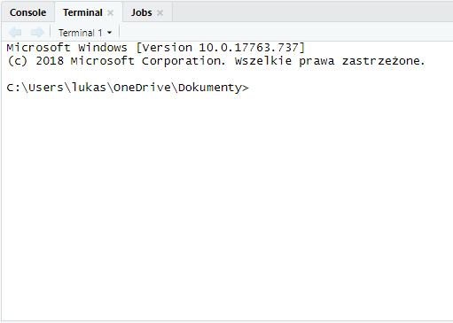

]

.pull-right[

- dostęp do konsoli Windows (cmd)

]

---

# Intefejs - Jobs

.pull-left[

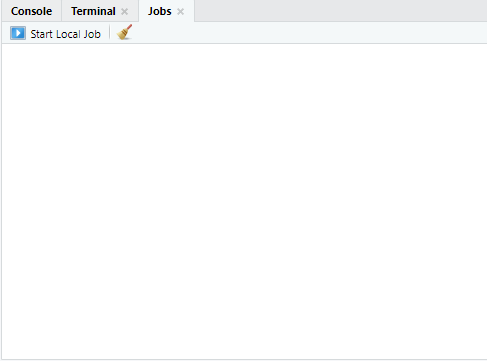

]

.pull-right[

- uruchamianie skryptów R niezależnie od IDE

- stosunkowo nowa funkcja

]

---

# Interfejs - Environment

.pull-left[

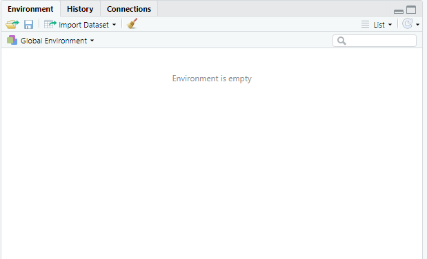

]

.pull-right[

- podgląd wszystkich obiektów z pamięci

- zbiory danych, liczby, funkcje

- możliwość załadowania lub zapisania zawartości pamięci 

- import zbiorów danych

- czyszczenie zawartości pamięci

- widok listy lub siatki

]

---

# Interfejs - History

.pull-left[

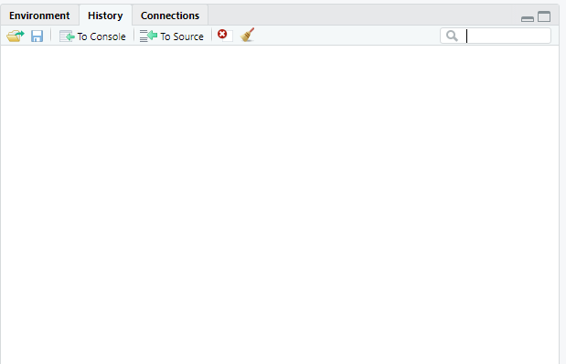

]

.pull-right[

- lista wszystkich uruchomionych funkcji
]

---

# Interfejs - Connections

.pull-left[

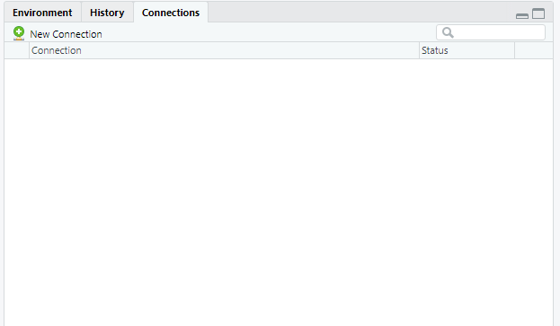

]

.pull-right[

- połączenia z bazami danych
]

---

# Interfejs - Files

.pull-left[

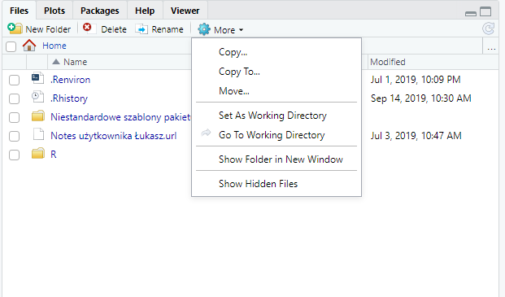

]

.pull-right[

- lista plików i katalogów w katalogu roboczym

- możliwe wykonywanie operacji na plikach, ale wygodniej to zrobić w Eksploratorze plików Windowsa, bo w RStudio nie działa metoda "przeciągnij i upuść"

]

---

# Interfejs - Plots

.pull-left[

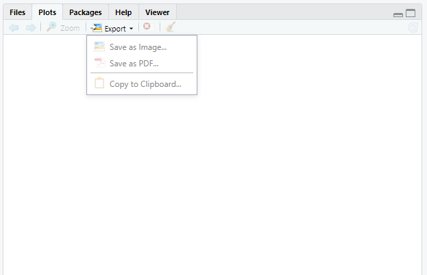

]

.pull-right[

- miejsce na wykresy statyczne

- można eksportować do pliku graficznego lub PDF

- zawartość może być przeniesiona do schowka

- przechowuje wszystkie wykresy od początku sesji R

]

---

# Interfejs - Packages

.pull-left[

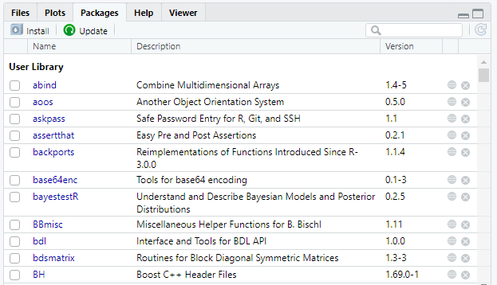

]

.pull-right[

- instalacja i aktualizacja pakietów

- lista zainstalowanych pakietów

- kliknięcie na nazwę powoduje przeniesienie do listy funkcji w ramach pakietu

]

---

# Interfejs - Help

.pull-left[

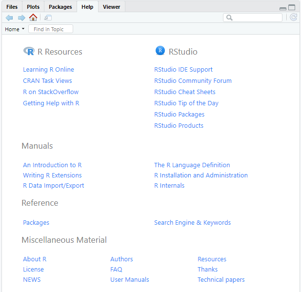

]

.pull-right[

- pomoc dotycząca funkcji

- na stronie domowej linki do materiałów o R

- zakładka otwierania po kliknięciu na F1, jeśli kursor znajduje się na nazwie funkcji

]

---

# Interfejs - Viewer

.pull-left[

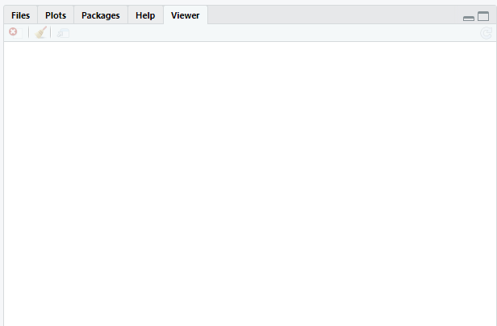

]

.pull-right[

- wyświetla elementy dynamiczne: wykresy, strony internetowe

]

---

# Interfejs - File

.pull-left[

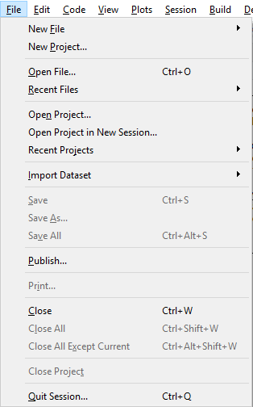

]

.pull-right[

- tworzenie nowego pliku

- tworzenie nowego projektu

- dostęp do projektów

- import pliku

- publikowanie na [RPubs](https://rpubs.com/)

- zamykanie plików

]

---

# Interfejs - Edit

.pull-left[

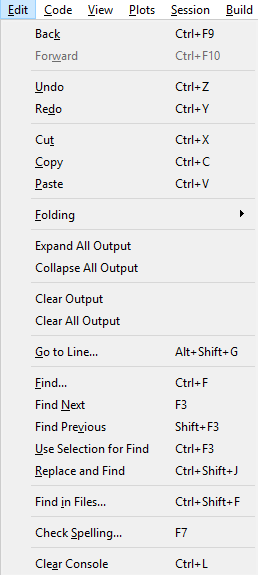

]

.pull-right[

- narzędzia edycji

- wyszukiwanie i zamiana

- sprawdzanie pisowni (dla j. angielskiego)

- czyszczenie konsoli

**Lista dostępnych opcji może się różnić w zależności od typu edytowanego pliku**

]

---

# Interfejs - Code

.pull-left[

]

.pull-right[

Funkcje związane z edycją i wyglądem kodu

- wstawianie sekcji

- komentarze

- formatowanie kodu

- uruchamianie kodu

- wczytywanie kodu do pamięci

Większość z tych operacji będziemy wykonywać z wykorzystaniem skrótów klawiszowych

---

# Interfejs - View

.pull-left[

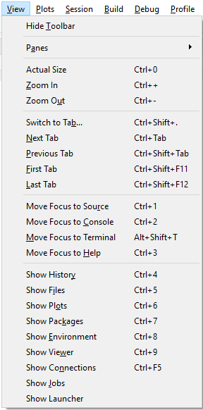

]

.pull-right[

Funkcje związane z układem RStudio

- przełączanie między plikami

- wybieranie paneli do wyświetlania

]

---

# Interfejs - Plots

.pull-left[

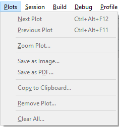

]

.pull-right[

Opcje wykresów

]

---

# Interfejs - Session

.pull-left[

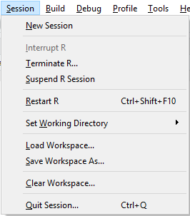

]

.pull-right[

- zakończenie R w przypadku braku reakcji 

- restart R

- przypisywanie katalogu roboczego

- zapisywanie/ładowanie/czyszczenie zawartości pamięci

]

---

# Interfejs - Debug

.pull-left[

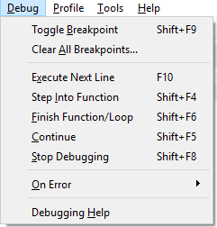

]

.pull-right[

Narzędzia debugowania kodu

]

---

# Interfejs - Profile

.pull-left[

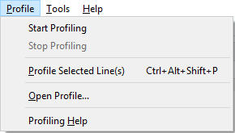

]

.pull-right[

Narzędzia profilowania kodu czyli sprawdzenie czasu wykonywania poszczególnych funkcji.

]

---

# Interfejs - Tools

.pull-left[

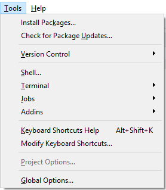

]

.pull-right[

- instalacja pakietów

- narzędzia kontroli wersji

- opcje projektu

- opcje globalne

]

---

# Interfejs - Help

.pull-left[

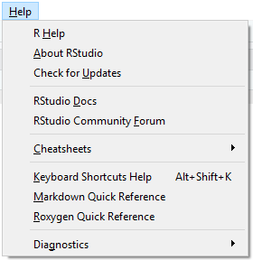

]

.pull-right[

- pomoc 

- ściągawki

]

---

class: inverse, center, middle

# Pytania?