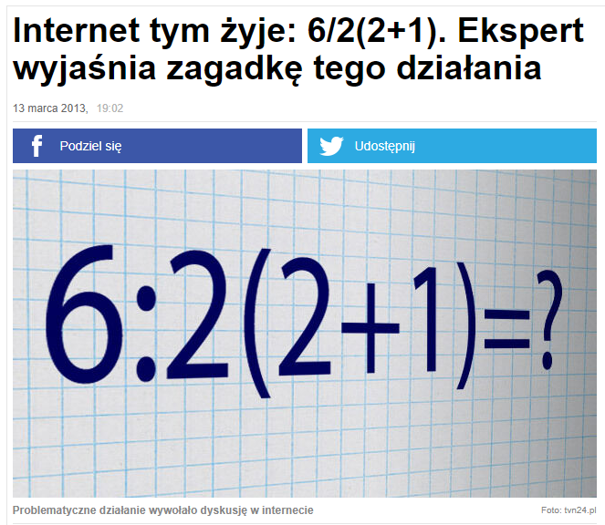
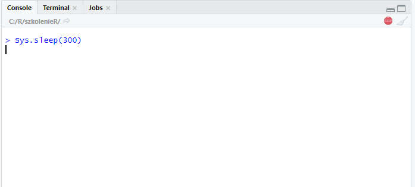

```{r include=FALSE}
library(tidyverse)
library(countdown)
```

# R club rules

- R jest wrażliwy na wielkość liter: dane i DANE to dwie różne rzeczy

- separatorem części dziesiętnej liczby jest kropka

- nie zapisujemy zawartości pamięci przy zamykaniu R

- w systemie Windows korzystamy z `/` (slash) lub `\\` przy ścieżkach plików 

---

# R jako kalkulator

--

<center></center>

[źródło](https://www.tvn24.pl/ciekawostki-michalki,5/internet-tym-zyje-6-2-2-1-ekspert-wyjasnia-zagadke-tego-dzialania,311736.html)

---

# Komentarze i sekcje

> Real programmers don't comment their code. If it was hard to write it should be hard to understand.

--

**Komentarz** w R to znak `#`

```

# treść komentarza

```

Skrót klawiszowy: ctrl + shift + c - używany do tworzenia i usuwania komentarza

--

**Sekcja** pozwala na porządkowanie i nawigowanie po skrypcie

```

# sekcja ------------------------------------------------------------------

```

Skrót klawiszowy: ctrl + shift + r

---

# Uruchamianie kodu R

- przycisk Run w oknie skryptu

- skrót klawiszowy: ctrl + enter

**Scenariusz 1**

Umieszczamy kursor w linii, którą chcemy wywołać i podejmujemy akcję uruchomienia.

**Scenariusz 2**

Zaznaczamy fragment kodu i go uruchamiamy.

---

# Funkcja w R

```

nazwa_funkcji(argument1 = wartosc1, argument2 = wartosc2)

```

--

- wartości argumentów można deklarować używając nazw - nieważna kolejność

```

nazwa_funkcji(argument2 = wartosc2, argument1 = wartosc1)

```

--

- wartości argumentów można deklarować pozycyjnie - ważna kolejność

```

nazwa_funkcji(wartosc1, wartosc2, wartosc3)

```

---

# Funkcje w R

- Duża liczba pakietów sprawia, że w różnych pakietach może być funkcja o takiej samej nazwie. 

- Wówczas decyduje kolejność, w jakiej pakiety były wczytywane.

- Do funkcji z danego pakietu można się odwołać w następujący sposób:

```

nazwa_pakietu::nazwa_funkcji()

```

---

# Uruchamianie kodu R



---

# Podstawowe operacje arytmetyczne

- `sqrt(x)` - pierwiastek
- `exp(x)` - zwraca wartość wyrażenia $e^x$
- `sign(x)` - zwraca znak wyrażenia
- `log(x, base)` - logarytm o podanej podstawie
- `abs(x)` - wartość bezwzględna
- `factorial(x)` - silnia

---

# Ćwiczenie

Oblicz $5\cdot log_327$

- skorzystaj z pomocy - klawisz `F1` jak kursor znajduje się na nazwie funkcji

- zapisz odpowiednią formułę deklarując argumenty pozycyjnie i za pomocą nazw argumentów

---

class: inverse

# Zadania

Oblicz $log_{10}100 + \sqrt{121}$

`r countdown(minutes = 4, seconds = 0, top = 0)`

---

# Wartości nieliczbowe

- `NA` - brak danych (not available)

- `NaN` - wartość nieokreślona (not a number)

- `Inf` - wartość nieskończona (infinity)

- `NULL` - zbiór pusty

Braki danych często uniemożliwiają wywołanie niektórych funkcji. Jeśli jest taka możliwość dodaje się argument `na.rm = TRUE` (skrót od NA remove).

---

# Obiekty

W R wszystko może być obiektem: zbiór danych, wykres, mapa. 

Operatorem przypisania w R to `<-`

```
nazwa <- obiekt
```

Można także korzystać ze znaku równości `=`, ale nie jest to zalecane, ponieważ ten znak pojawia się w wielu innych miejscach, a `<-` oznacza wyłącznie stworzenie obiektu.

---

# Obiekty

.pull-left[


]

.pull-right[

Konwencje nazywania obiektów:

- alllowercase

- period.separated

- underscore_separated

- lowerCamelCase

- UpperCamelCase

Nazwa obiektu nie może zaczynać się od liczby

]

---

# Typy obiektów

- wartości

- wektor

- czynnik/faktor

- macierz

- lista

- ramka danych

---

# Stałe wbudowane

- `pi`

- `letters` i `LETTERS`

- `month.abb` i `month.name`

---

# Wektor

Wektor tworzy się z wykorzystaniem funkcji `c()`.

Typy wektorów

- logiczne

- liczbowe

- tekstowe

--

Indeksowanie wektora `wektor[numer_elementu]`


---

# Funkcje związane z wektorami

- `length()` - zwraca długość wektora

- `typeof()` - zwraca typ obiektu

- `is.numeric()`, `is.logical()` - czy wektor jest danego typu

- `as.numeric()`, `as.logical()` - rzutowanie wektora na dany typ

- `rep()` - tworzy wektor poprzez replikację podanego argumentu

- `seq()` - tworzy wektor jako sekwencję o podanym początku i końcu

---

# Generowanie wartości

- losowanie wartości z podanego zakresu - funkcja `sample()`

- losowanie wartości z rozkładu:

  - jednostajnego - funkcja `runif()`
  
  - normalnego - funkcja `rnorm()`
  
--
  
ziarno generatora: `set.seed()`

---

# Funkcje agregujące

- `mean()` - średnia

- `sum()` - suma

- `var()` - wariancja

- `sd()` - odchylenie standardowe

- `median()` - mediana

- `quantile()` - kwantyl podanego rzędu

- `min()` - minimum

- `max()` - maksimum

Aby policzyć skośność lub kurtozę trzeba zainstalować pakiet _e1071_.

- `skewness()` - skośność

- `kurtosis()` - kurtoza

---

# Funkcja `summary()`

- szybkie podsumowanie dowolnego typu danych

- wygląd raportu różni się w zależności od typu obiektu

---

# Skale


---

# Skale


---

# Czynnik/faktor

Służy do przechowywania danych jakościowych o mało licznej liczbie kategorii, mierzonych na skali nominalnej i porządkowej.

```{r}
wyk <- rep(c("podstawowe", "średnie", "wyższe"), c(5,3,2))
wyk
```

```{r}
wyk_f <- factor(wyk)
wyk_f
```

---

# Macierz

Tworzona za pomocą funkcji `matrix(wartosci, nrow = liczba_wierszy, ncol = liczba_kolumn)`

--

Indeksowanie macierzy `macierz[numer_wiersza, numer_kolumny]`

---

# Ramka danych

Tworzona za pomocą funkcji `data.frame()`

```{r}
df <- data.frame(plec=c("m", "k", "k", "m", "k", "m", "m", "m"),
                 wzrost=c(173, 170, 163, 178, 169, 180, 175, NA),
                 wydatki=c(1200, 2340, 1900, 890, 1010, 3099, 1478, 2030),
                 pali=c(T, F, F, F, T, F, NA, T))
```

---

# Trzy sposoby indeksowania:

- po numerze kolumny `df[, 2]`
- po nazwie kolumny `df[, "Wzrost"]`
- z wykorzystaniem symbolu dolara `df$wzrost`

---

# Lista

Tworzenie za pomocą funkcji `list()`

Może zawierać wiele różnych typów danych

---

# Indeksowanie listy


[źródło](https://twitter.com/hadleywickham/status/643381054758363136)

---

class: inverse, center, middle

# Pytania?