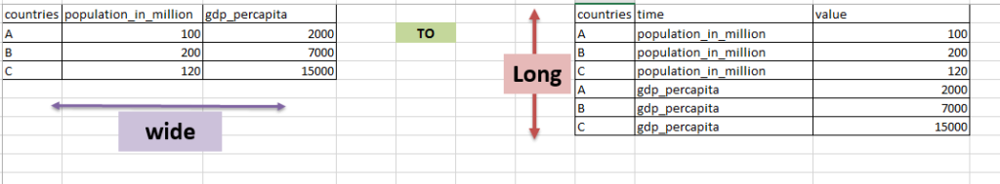

```{r include=FALSE}
library(tidyverse)
library(countdown)
```

# Rozpoczynanie pracy z R

.pull-left[
__Nowy projekt__

1. Otwórz RStudio
2. Stwórz nowy projekt
3. Przenieś dane do folderu projektu
4. Otwórz nowy skrypt R
5. (Zainstaluj i) wczytaj biblioteki
6. Wczytaj dane
7. Analizuj

]

.pull-right[
__Istniejący projekt__

1. Otwórz RStudio
2. Otwórz istniejący skrypt R
3. Wczytaj biblioteki
4. Wczytaj dane
5. Kontyuuj analizę

]

---

# Przygotowanie danych

- braki danych

- duplikaty

- wartości odstające

- ujednolicone kategorie

[źródło](https://www.analyticsinhr.com/blog/hr-analytics-data-cleaning-guide/)

---

class: inverse

# Zadanie

Wczytaj zbiór danych dotyczący [filmów](http://wawrowski.edu.pl/data/movies.csv).

`r countdown(minutes = 5, seconds = 0, top = 0)`

---

# R base vs. tidyverse

**Podstawowe funkcje R**

```{r eval=FALSE}
widest_petals <- by(iris, 
                    INDICES = iris$Species, 
                    FUN = function(x){
                      x[x$Petal.Width == max(x$Petal.Width), ] 
                    })

do.call(rbind, widest_petals)

```

--

**Funkcje pakietu tidyverse**

```{r eval=FALSE}

iris %>% 
  group_by(Species) %>% 
  filter(Petal.Width == max(Petal.Width))

```

[źródło](https://tavareshugo.github.io/data_carpentry_extras/base-r_tidyverse_equivalents/base-r_tidyverse_equivalents.html)

---

<center></center>

---

# Przetwarzanie potokowe

Sekwencja zdarzeń - w życiu

```
obudź się %>%
  wyjdź z łóżka %>%
  skorzystaj z łazienki %>%
  zjedź śniadanie %>%
  ubierz się %>%
  idź do pracy
```

[źródło](https://twitter.com/WeAreRLadies/status/1172576445794803713)

---

# Przetwarzanie potokowe

Użycie operatora **pipe**: `%>%` (łącznik) ułatwia zarządzanie kodem i pisanie czytelnej składni poprzez wykorzystanie istniejących struktur danych:

Nowe obiekty

```{r eval=FALSE}

iris_3kol <- select(iris, Petal.Length, Petal.Width, Species)
iris_3kol_wymiar <- mutate(iris_3kol, petal_wymiar=Petal.Length+Petal.Width)
iris_3kol_wymiar_setosa <- filter(iris_3kol_wymiar, Species=="setosa")

```

--

Zagnieżdżanie

```{r eval=FALSE}

iris_setosa <- filter(mutate(select(iris, Petal.Length, Petal.Width, Species), 
                             petal_wymiar=Petal.Length+Petal.Width),
                      Species=="setosa")

```

---

# Przetwarzanie potokowe

Przetwarzanie potokowe

```{r eval=FALSE}

iris_setosa <- iris %>%
  select(Petal.Length, Petal.Width, Species) %>%
  mutate(petal_wymiar=Petal.Length+Petal.Width) %>%
  filter(Species=="setosa")

```

--

Znak `%>%` oznacza, że jako argument wejściowy `data` w kolejnej funkcji zostanie wpisany wynik działania wcześniejszej funkcji.

---

# Filtrowanie - `filter()`

Porównywanie:

- `=`  symbol przypisania (nie jest używany w filtrowaniu)

- `==` symbol porównania (jest równe)

- `!=` symbol negacji (jest różne)

- `>` i `<` większe i mniejsze

Operatory:

- `&` - i

- `|` - lub (alternatywa)

- `%in%` - wartość ze zbioru

- `!` - negacja

---

class: inverse

# Zadanie

Utwórz zbiór danych zawierający filmy, które są filmami akcji, miały swoją premierę po 2010 roku i trwały powyżej 120 minut lub miały ocenę powyżej 8.0. Alternatywa ma dotyczyć tylko dwóch ostatnich warunków.

`r countdown(minutes = 7, seconds = 0, top = 0)`

---

# Braki danych

W przypadku cech logicznych i numerycznych brak danych jest oznaczany jako `NA`. Jest to wartość nieliczbowa i **nie można** jej porównywać w następujący sposób:

- `zmienna == NA`

- `zmienna != NA`

- `zmienna == "NA"`

- `zmienna != "NA"`

tylko z wykorzystaniem funkcji `is.na()`:

- `is.na(zmienna)`

- `!is.na(zmienna)`

Funkcja `complete.cases()` służy do identyfikacji obserwacji, które zawierają braki danych.

---

class: inverse

# Zadanie

Wczytaj zbiór danych z Polskiego Generalnego Sondażu Społecznego - [pgss.RData](http://wawrowski.edu.pl/data/pgss.RData) za pomocą funkcji `load()`. Zmienna _q34_ zawiera informacje o dochodach z pracy respondenta. Utwórz nowy zbiór danych, który nie będzie zawierał braków danych w tej zmiennej.

`r countdown(minutes = 10, seconds = 0, top = 0)`

--

Ile obserwacji liczyłby ten zbiór danych gdyby usunąć wszystkie obserwacje zawierające braki danych.

???

pgss_na <- pgss %>% filter_all(all_vars(!is.na(.)))

pgss_na <- pgss %>% filter(complete.cases(.))

---

# Wybieranie kolumn - `select()`

Wybór kolumn, które mają się znaleźć w nowym zbiorze:

```{r eval=FALSE}

iris2 <- iris %>%
  select(Species, Petal.Length, Petal.Width)

```

Które nie mają się znaleźć w nowym zbiorze:

```{r eval=FALSE}

iris2 <- iris %>%
  select(-Petal.Length, -Petal.Width)

```

Które mają znaleźć się w nowym zbiorze z nową nazwą:

```{r eval=FALSE}

iris2 <- iris %>%
  select(gatunek=Species, Petal.Length, Petal.Width)

```

---

# Kolejność w przetwarzaniu potokowym

GOOD

```{r eval=FALSE}
iris %>%
  filter(Petal.Width < 0.5) %>%
  select(Species, Sepal.Length, Sepal.Width)

```
```{r echo=FALSE}
iris %>%
  filter(Petal.Width < 0.5) %>%
  select(Species, Sepal.Length, Sepal.Width) %>%
  head()

```

--

BAD

```{r error=TRUE}
iris %>%
  select(Species, Sepal.Length, Sepal.Width) %>%
  filter(Petal.Width < 0.5)

```

---

# Zmiana nazwy - `rename()`

Zapis w konwencji `nowa_nazwa=stara_nazwa`

Można także wykorzystać funkcję `select()` - zmieniając nazwę podczas wybierania zmiennych

---

# Nowa zmienna/modyfikacja - `mutate()`

```{r eval=FALSE}

iris <- iris %>%
  mutate(petal=Petal.Length+Petal.Width,
         sepal=Sepal.Length+Sepal.Width,
         iloraz=petal/sepal)

```

- `mutate_all` - modyfikacja wszystkich zmiennych według podanej formuły

- `mutate_if` - modyfikacja wszystkich zmiennych spełniających warunek

- `mutate_at` - modyfikacja wszystkich wskazanych zmiennych

---

class: inverse

# Zadanie

W zbiorze `movies` stwórz nową zmienną, która będzie zawierała wiek filmu.

`r countdown(minutes = 7, seconds = 0, top = 0)`

---

## Podsumowanie - `summarise()` i `summarize()`

```{r}

iris %>%
  summarise(liczebnosc=n(),
            srednia_pl=mean(Petal.Length),
            mediana_sl=median(Sepal.Length))

```

---

class: inverse

# Zadanie 

Ile wynosiła średnia, mediana i odchylenie standardowe czasu trwania analizowanych filmów?

`r countdown(minutes = 5, seconds = 0, top = 0)`

---

# Grupowanie - `group_by()`

Najlepiej działa w połączeniu z `summarise()`:

```{r}
iris %>%
  group_by(Species) %>%
  summarise(liczebnosc=n(),
            srednia_pl=mean(Petal.Length))

```

---

# Liczebności - `count()`

Jeżeli chcemy tylko wyznaczyć liczebności grup to wystarczy funkcja `count()`:

```{r}
iris %>%
  count(Species)
```

---

class: inverse

# Zadanie

Wybierz filmy z lat 2000-2010. Ile filmów wyprodukowano w poszczególnych latach i ile wynosiła ich średnia ocena?

`r countdown(minutes = 5, seconds = 0, top = 0)`

---

# Łączenie danych


[źródło](https://rpubs.com/williamsurles/293454)

---

class: inverse

# Zadanie

Po wczytaniu zbioru danych [gus.RData](http://wawrowski.edu.pl/data/gus.RData) połącz ze sobą zbiory danych zawierające informacje o liczbie przedsiębiorstw na 10 tys. mieszkańców (zbiór _pod_10tys_), stopie bezrobocia (zbiór _bezrobocie_) oraz wynagrodzeniu (zbiór _wyn_).

`r countdown(minutes = 10, seconds = 0, top = 0)`

---

# Szeroka i wąska reprezentacja danych



[źródło](https://www.datasciencemadesimple.com%2Freshape-in-r-from-wide-to-long-from-long-to-wide)

---

# Animacja


[źródło](https://github.com/gadenbuie/tidyexplain)

---

# Zbiór _iris_

```{r}
head(iris)
```


---

# Wide -> long - `pivot_longer()`

```{r}
iris_long <- iris %>%
  mutate(id=1:nrow(iris)) %>% 
  pivot_longer(Sepal.Length:Petal.Width)

head(iris_long)
```

---

# Long -> wide - `pivot_wider()`

```{r}
iris_wide <- iris_long %>%
  pivot_wider()

head(iris_wide)
```
