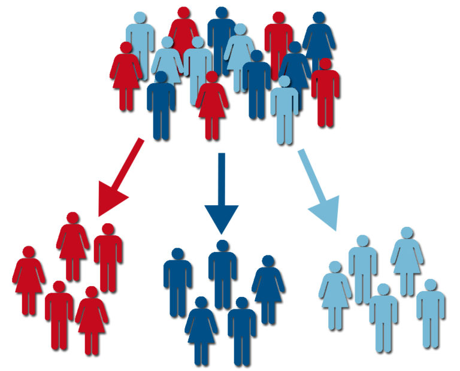
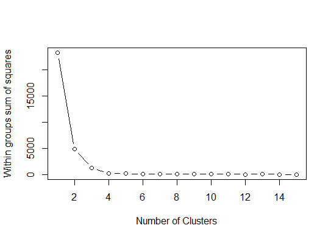

```{r include=FALSE}
library(tidyverse)

load("../data/rossmann.RData")

sklep77 <- rossmann %>%
  filter(sklep_id==77, czy_otwarty=="Tak")

```


# Plan dnia

8:30 - 10:15 - Wizualizacja danych

10:30 - 12:30 - Przetwarzanie danych

13:15 - 15:00 - Grupowanie

15:15 - 17:15 - Klasyfikacja 

---

# System kontroli wersji (git)

Oprogramowanie do śledzenia zmian w kodzie źródłowym.

- umożliwia współpracę wielu osób w jednym projekcie
- pliki są przechowywane lokalnie oraz w repozytorium na serwerze
- wymaga zainstalowania programu [git](https://git-scm.com/downloads)
- darmowe platformy: [github](https://github.com/), [bitbucket](https://bitbucket.org/), [gitlab](https://about.gitlab.com/)

---

# Repozytorium na zajęcia

New project -> Version Control -> Git -> Repository URL

https://github.com/lwawrowski/cdv_bigdata.git

Alternatywnie: Clone or download -> Download ZIP

---

# Wykres kafelkowy

```{r echo=FALSE, fig.width=8}
sklep77 %>%
  count(czy_promocja, czy_swieto_szkolne) %>%
  ggplot(aes(x=czy_promocja, y=czy_swieto_szkolne, fill=n)) + 
  geom_tile() + 
  geom_label(aes(label = n), color="white") +
  scale_fill_gradient(low  = "#6baed6", high = "#08519c") + 
  theme_light()
```

Wybór kolorów: http://colorbrewer2.org/

---

# Analiza współzależności

.pull-left[
Test niezależności $\chi^2$ (chi-kwadrat).

- H0: cechy są niezależne
- H1: cechy nie są niezależne

Przyjęty poziom istotności $\alpha = 0,05$.

Jeśli wartość p (p-value) jest mniejsze od $\alpha$ - **odrzucamy H0**.
]

--

.pull-right[


]

---

# Analiza współzależności w R

Funkcja `chisq.test()`, która jako argument przyjmuje tablicę kontyngencji stworzoną za pomocą funkcji `table()`.

Dodatkowo możemy policzyć siłę tej zależności:

$$V=\sqrt\frac{\chi^2}{n \cdot min(k-1; r-1)}$$

---

class: inverse

# Zadanie 1

Sprawdź istnienie zależności pomiędzy dniem tygodnia a rozpoczęciem się promocji dla sklepów typu b. Z analizy wyeliminuj soboty i niedziele.

--

```{r echo=TRUE, eval=FALSE}
rossmann %>%
  filter(sklep_typ == "b", dzien_tyg %in% 1:5)
```


---

# Wykres uwzględniający zmianę w czasie

```{r echo=FALSE, message=FALSE, warning=FALSE}
library(lubridate)

sklep77 %>%
  mutate(data=ymd(data),
         dzien_tyg=as.factor(dzien_tyg)) %>%
  ggplot(aes(x=data, y=sprzedaz, color=dzien_tyg)) + geom_point()
```

---

# Pakiet lubridate

Zestaw funkcji do operowania na datach.

- y - rok (year)
- m - miesiąc (month)
- d - dzień (day)
- h - godzina (hour)
- m - minuta (minute)

Przykłądy funkcji:

- ymd - konwertuje tekst zapisany w postaci rok-miesiąc-dzień na obiekt daty
- dmy_hm - konwertuje tekst zapisany w postaci dzień-miesiąc-rok godzina:minuta na obiekt daty
- month - pobiera z obiektu daty informację o miesiącu
- year - pobiera z obiektu daty informację o roku
- week - pobiera z obiektu daty informację o tygodniu roku
- ...

---

class: inverse

# Zadanie 2 

Dla wybranego sklepu przedstaw na wykresie średnią sprzedaż w ujęciu tygodniowym. 

```{r eval=FALSE, include=FALSE}
sklep77_tydzien <- sklep77 %>%
  mutate(data=ymd(data),
         tydzien=week(data)) %>%
  group_by(tydzien) %>%
  summarise(sprzedaz=mean(sprzedaz))

ggplot(sklep77_tydzien, aes(x=tydzien, y=sprzedaz)) + geom_point()
```

---

# Interaktywne wykresy z pakietem `plotly`. 

- biblioteka `plotly` to interfejs interaktywnych wykresów dla różnych środowisk (R, Python, JS)
- posiada własną składnię tworzenia wykresów
- bardzo prosto można zamienić statystyczny wykres `ggplot` na interaktywny za pomocą funkcji `ggplotly()`

---

class: inverse

# Zadanie 3

Pobierz ze strony NBP dane na temat dziennego średniego kursu euro w 2014 roku. Dodaj ten plik do projektu. 

---

# Łączenie danych


---

class: inverse

# Zadanie 4

Oblicz wartość sprzedaży w sklepie Rossmann w PLN. W którym miesiącu zanotowano najniższą sprzedaż, a w którym najwyższą?

---

# Długa i szeroka reprezentacja danych


---

# Funkcje `gather` i `spread`

Niedługo już nieaktualne: https://tidyr.tidyverse.org/dev/articles/pivot.html

`gather`: wide -> long

```{r eval=FALSE, include=TRUE}
gather(data = zbior_danych,
       key = zmienna_nazwy_kolumn,
       value = zmienna_wartosc,
       wybrane_kolumny)
```


`spread`: long -> wide

```{r eval=FALSE, include=TRUE}
spread(data = zbior_danych,
       key = zmienna_nazwy_kolumn,
       value = zmienna_wartosc)
```


---

class: inverse

# Zadanie 5

Zbiór danych dotyczący wyborów do sejmików na poziomie powiatów przekształć w taki sposób, aby uzyskać informację o partii, która wygrała w danym powiecie.

---

# Podział metod

- Uczenie nienadzorowane (unsupervised learning)

Końcowy wynik nie jest znany, np. grupowanie.

- Uczenie nadzorowane (supervised learning)

Końcowy wynik jest znany, np. klasyfikacja.

---

# Podział metod


---

# Segmentacja

Segmentacja/grupowanie/klasteryzacja czyli:

podział zbioru obiektów na grupy obiektów podobnych. 

W rezultacie:

- obiekty znajdujące się w tym samym segmencie powinny być do siebie podobne,
- obiekty znajdujące się w różnych segmentach powinny się od siebie różnić.

---

# Idea

<center></center>

---

# Etapy segmentacji

- sformułowanie celu analizy
- dobór cech
- wybór metody segmentacji
- przeprowadzenie segmentacji
- weryfikacja wyników
- interpretacja wyników

---

# Podobieństwo obiektów

W statystyce miarą podobieństwa jest metryka np. euklidesowa lub miejska.

Stosowanie metryk wymaga zapewnienia porównywalności różnych cech poprzez zastosowanie np. standaryzacji.

Standaryzacja pozbawia cechy jednostek, w jakich są mierzone - ustalając średnią równą 0 i odchylenie standardowe równe 1.

---

# Metoda k-średnich

Najpopularniejsza metoda grupowania obiektów, która efektywnie działa zarówno na małych, jak i dużych zbiorach.

Wymaga zadeklarowania końcowej liczby segmentów.

__Algorytm__

1. Określ liczbę grup - $k$
2. Dla każdej grupy ustal wyjściowy centroid
3. Przypisz każdy obiekt do najbliższego centroidu
4. Na podstawie przypisanych obiektów oblicz nowe współrzędne centroidu
5. Sprawdź czy każdy obiekt przypisany jest do najbliższego centroidu
6. Jeśli nie to zmień przypisanie obiektu do centrodu
7. Jeśli nie obserwuje się żadnych przesunięć to algorytm się kończy

---

# Ustalanie liczby grup

W metodzie k-średnich należy podać docelową liczbę skupień. Możemy spróbować ustalić tą wartość na podstawie wykresu osypiska (ang. _elbow method_).

<center></center>

Wybieramy liczbę skupień po której nie następuje już gwałtowny spadek wartości wariancji wewnątrz-grupowej.

---

# Grupowanie w R

- funkcja `scale()` do standaryzacji danych
- funkcja `kmeans()` do ustalenia skupień

--

Pakiet `ClusterR`

- funkcja `Optimal_Clusters_KMeans` do wyświetlenia wykresu osypiska
- funkcja `KMeans_rcpp` do ustalenia skupień z wykorzystaniem algorytmu kmeans++

---

class: inverse

# Zadanie 6

Przeprowadź grupowanie powiatów województwa wielkopolskiego.

---

# Klasyfikacja

[A visual introduction to machine learning](http://www.r2d3.us/visual-intro-to-machine-learning-part-1/)

---

# Drzewo klasyfikacyjne

Zalety:

- łatwa interpretacja
- nie trzeba normalizować cech
- rozwiązuje problemy liniowe i nieliniowe

Wady:

- mała efektywność przy małych zbiorach danych
- łatwo można przeuczyć

---

class: inverse

# Zadanie 7

Zainstaluj następujące pakiety: `caTools`, `rpart`, `rpart.plot`, `caret`.

---

# Miary dopasowania

[Tablica pomyłek](https://pl.wikipedia.org/wiki/Tablica_pomy%C5%82ek)

[Czułość i swoistość](https://pl.wikipedia.org/wiki/Czu%C5%82o%C5%9B%C4%87_i_swoisto%C5%9B%C4%87)


